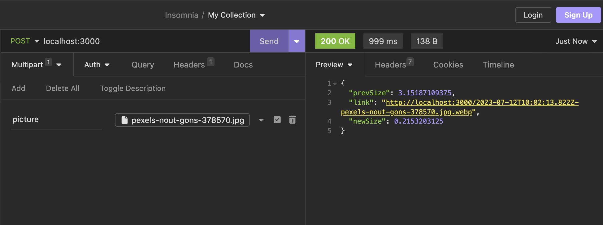

to run

```
npm install
```

then

```
npm start
```

then upload file to http://localhost:3000 (post, multipart/form-data)



link to the file will be in the response with basic data about compression
